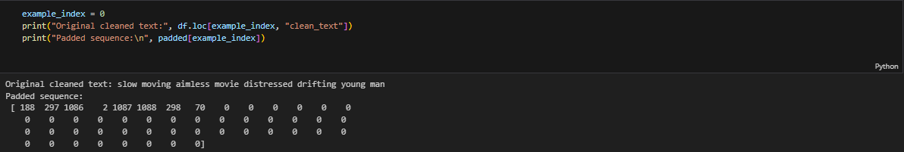
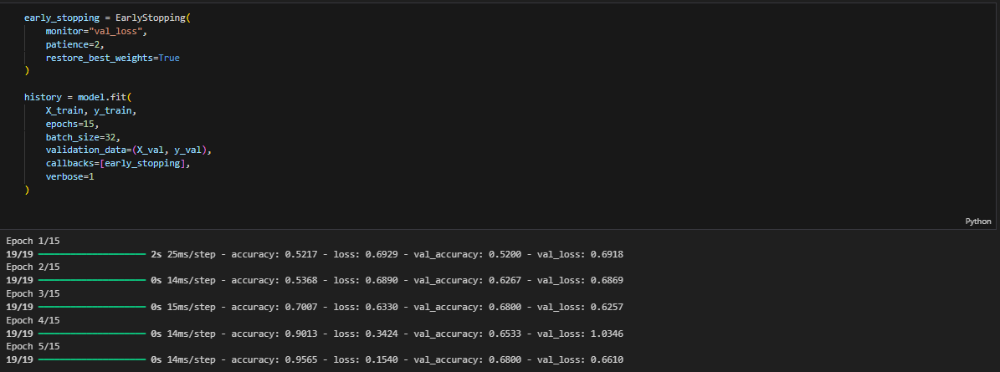

# Sentiment Analysis with BiLSTM

## Overview
This project uses a Bidirectional LSTM neural network to classify movie review sentiment from text. The workflow covers text cleaning, tokenization, sequence padding, deep learning model training, and evaluation on held-out test data.

## Coursework Context
This project was completed as part of my M.S. in Data Analytics program at Western Governors University (WGU). Screenshots from the original written submission are preserved in `assets/report-extracts/`.

## Dataset
- Source: IMDB labeled sentences dataset
- Total reviews used: 748
- Label distribution: 362 negative, 386 positive
- Split: 598 train, 75 validation, 75 test

## Preprocessing
- lowercased text
- removed URLs and HTML
- removed punctuation and non-alphanumeric characters
- removed English stopwords with NLTK
- tokenized text with a Keras tokenizer using an OOV token
- padded all sequences to a fixed length of 50 tokens

## Model
- Embedding layer: 100 dimensions
- Bidirectional LSTM: 128 units
- Dense hidden layer: 64 units
- Dropout: 0.4 and 0.3
- Output: sigmoid for binary classification
- Early stopping on validation loss with patience of 2

## Results
- Test loss: 0.5792
- Test accuracy: 0.7600
- Precision: 0.8846
- Recall: 0.6053
- F1-score: 0.7188

## Model Artifact
- The trained `imdb_sentiment_bilstm_model.keras` file is included in `models/` so reviewers can inspect or load the saved network without retraining the model from scratch.

## Selected Visuals

## Key Takeaways
- The model achieved strong precision, meaning positive sentiment predictions were usually correct.
- Recall was lower than precision, showing the model still missed some positive examples.
- Sequence length selection mattered: a 50-token limit preserved 99.3% of the reviews while keeping the model tractable.

## Included Files
- `notebooks/sentiment_bilstm.ipynb`
- `data/imdb_labelled.txt`
- `data/train_dataset.csv`
- `data/validation_dataset.csv`
- `data/test_dataset.csv`
- `models/imdb_sentiment_bilstm_model.keras`
- `models/README.md`
- `requirements.txt`

---

*\* I used Claude (Anthropic) to help organize and stage this coursework into a GitHub portfolio repository. The analysis, code, and results are entirely my own.*